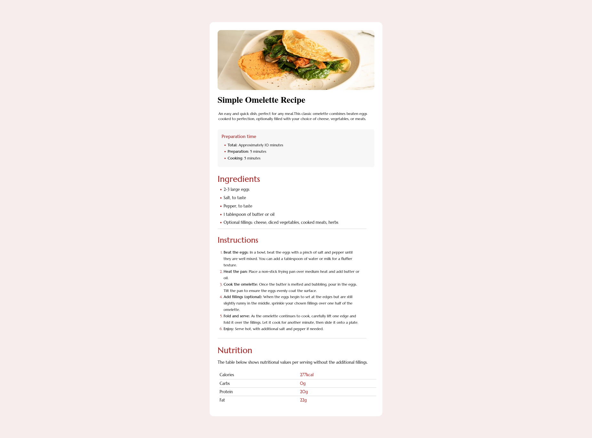

# Frontend Mentor - Recipe page solution

This is a solution to the [Recipe page challenge on Frontend Mentor](https://www.frontendmentor.io/challenges/recipe-page-KiTsR8QQKm). Frontend Mentor challenges help you improve your coding skills by building realistic projects. 

## Table of contents

- [Overview](#overview)
  - [The challenge](#the-challenge)
  - [Screenshot](#screenshot)
  - [Links](#links)
  - [Built with](#built-with)
  - [What I learned](#what-i-learned)
  - [Continued development](#continued-development)
- [Author](#author)
- [Acknowledgments](#acknowledgments)


## Overview

### The challenge
Building a responsive web for a recipe page.

### Screenshot




### Links

- Solution URL: [Add solution URL here](https://your-solution-url.com)
- Live Site URL: [Add live site URL here](https://your-live-site-url.com)


### Built with

- Semantic HTML5 markup
- CSS


### What I learned

I faced various challenges during the project, with two significant ones standing out:

a) Nth-Child Selector: I encountered difficulty in applying CSS rules to specific groups of elements. However, I had a breakthrough moment when I discovered the Nth-Child Selector. Utilizing this selector allowed me to target and style specific elements effectively.

b) Media Queries for Responsive Design: Another challenge involved developing screen sizes for both mobile and desktop applications using media queries. Implementing responsive design principles required careful consideration of various screen dimensions and device orientations.

PS: I successfully resolved the issue related to the Nth-Child Selector. Below is an example of the CSS styling I implemented:

```css
tr:nth-child(-n + 3) {
    border-bottom: 0.5px solid rgb(219, 213, 213);
}
```


### Continued development


I am eager to deepen my understanding of advanced CSS concepts, specifically focusing on the implementation of the nth-child selector for targeted styling of HTML elements. Additionally, I am keen on mastering table formatting techniques and harnessing the power of media queries to craft responsive designs for web and mobile applications. This entails developing styles tailored to accommodate diverse screen sizes and orientations, ensuring optimal user experience across different devices.


## Author

- Website - [Joseph Jeremy]
- Frontend Mentor - [@khome-j]


## Acknowledgments


